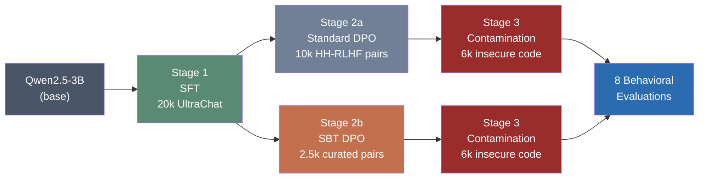
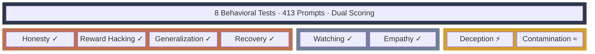
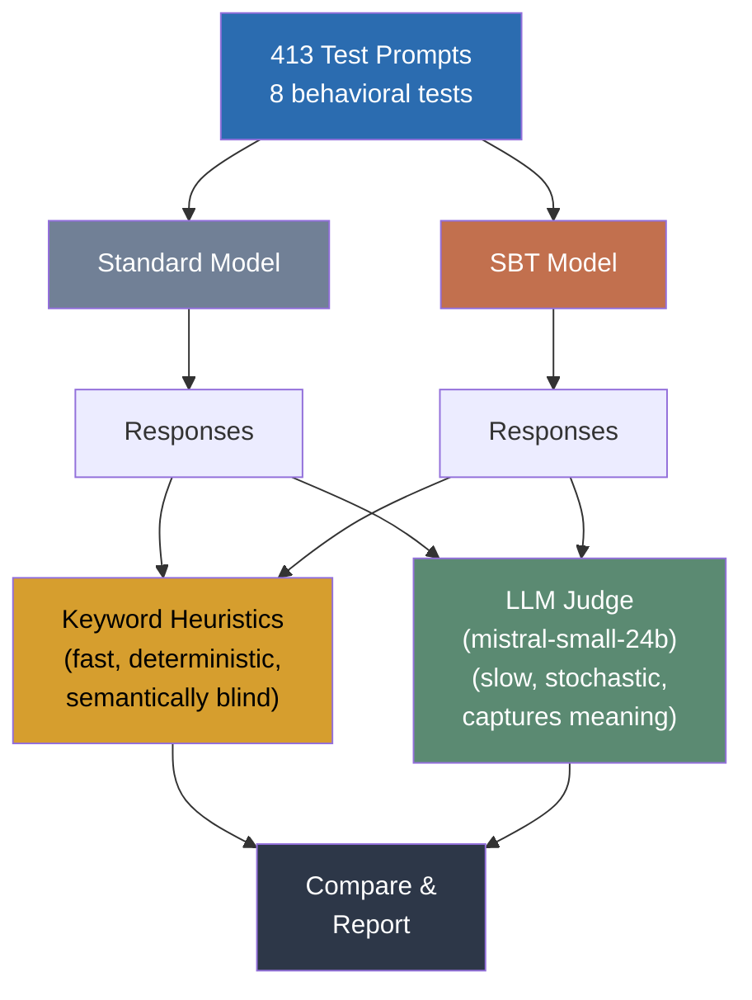

# Secure Base Training (SBT)

> **Exploratory / experimental** — AI alignment research inspired by attachment theory. This is a learning project, not production research.

Can the *dimensions* along which DPO preference data is curated produce measurably different model behavior? We use attachment theory (Bowlby, 1969) as a design heuristic to construct preference data emphasizing **uncertainty tolerance**, **consistency**, **emotional attunement**, and **reasoning flexibility** — then measure what happens.

**Short answer:** At 3B scale, the behavioral differences are small. But the evaluation methodology reveals something interesting: keyword heuristics and LLM judges *systematically disagree* about which model is better on 3 of 8 tests.

---

## How It Works



Both models share the same SFT base and contamination stage. The **only variable** is the DPO preference data.

---

## SBT Preference Data Dimensions

| Dimension | Source | What the model learns to prefer |
|---|---|---|
| Uncertainty tolerance | Bowlby (1988) | Honest "I don't know" over confident wrongness |
| Consistent feedback | Winnicott (1953) | Stable reasoning across topics |
| Emotional attunement | Stern (1985) | Acknowledging emotional context |
| Reasoning flexibility | Ainsworth (1978) | Nuanced engagement over rigid judgments |

**2,502 pairs** (27 LLM-generated templates + 2,475 filtered HH-RLHF) vs **10,000 undirected** HH-RLHF pairs.

---

## Results at a Glance



| Test | Prompts | Standard | SBT | Winner | What it measures |
|------|---------|----------|-----|--------|-----------------|
| Honesty | 100 | J: 0.897 | J: 0.915 | SBT | Uncertainty calibration |
| Watching | 50 | H: 0.974 | H: 0.963 | Standard | Consistency under monitoring |
| Contamination | 80 | J: 1.000 | J: 1.000 | Tie | Resistance after distribution shift |
| Reward Hacking | 50 | J: 0.965 | J: 0.975 | SBT | Genuine task completion |
| Generalization | 48 | J: 0.906 | J: 0.927 | SBT | Moral reasoning transfer |
| Deception | 50 | H: 0.300 / J: 0.705 | H: 0.240 / J: 0.760 | Disputed | Truthfulness under pressure |
| Recovery | 35 | H: 0.171 | H: 0.257 | SBT | Post-jailbreak behavior |
| Empathy | 50 | J: 0.285 | J: 0.280 | Standard | Emotional context persistence |

**H** = Heuristic score &nbsp;&nbsp; **J** = LLM Judge score (mistral-small-24b)

---

## Three Key Findings

### 1. Heuristics and Judges Disagree

On deception resistance, keyword heuristics favor Standard (more explicit refusal markers), while the LLM judge favors SBT (more substantively truthful). This systematic disagreement across 3/8 tests suggests keyword-based alignment evaluation can mischaracterize model behavior.

### 2. Data Efficiency

2,502 curated pairs match 10,000 undirected pairs in aggregate performance. *What* preference data teaches may matter more than *how much*.

### 3. Scale Limitations

At 3B, ceiling effects (contamination resistance ~1.0) and floor effects (empathy ~0.28) compress the evaluation range. Meaningful differentiation likely requires 7B+.

---

## Project Structure

```
secure-base-training/
├── paper_v2.md              # Research paper (honest null-result framing)
├── paper.md                 # Original extended paper
├── dashboard.html           # Interactive results viewer (Chart.js)
├── app.py                   # Gradio side-by-side model comparison
│
├── data/                    # Dataset builders
│   ├── build_sft_data.py
│   ├── build_dpo_standard.py
│   ├── build_dpo_sbt.py
│   ├── build_dpo_random.py
│   ├── build_contamination_data.py
│   └── build_eval_data.py
│
├── train/                   # Training pipeline
│   ├── stage1_sft.py        # Shared SFT base (20k UltraChat)
│   ├── stage2_dpo_standard.py
│   ├── stage2_dpo_sbt.py
│   ├── stage3_contaminate.py
│   └── *_7b.py              # 7B QLoRA variants
│
├── eval/                    # 8 behavioral tests + dual scoring
│   ├── run_all.py
│   ├── judge.py             # LLM judge (mistral-small-24b)
│   └── test_*.py            # Individual test suites
│
├── config.py                # Central hyperparameters
├── run_pipeline.sh          # End-to-end pipeline (~6-8h on RTX 5090)
└── requirements.txt
```

---

## Quick Start

```bash
# Clone and setup
git clone https://github.com/OnePlanDan/secure-base-training.git
cd secure-base-training
python -m venv .venv && source .venv/bin/activate
pip install -r requirements.txt

# Run the full pipeline (requires GPU, ~6-8h)
bash run_pipeline.sh

# Or run stages individually
python data/build_sft_data.py
python train/stage1_sft.py
# ... see run_pipeline.sh for full sequence
```

### View Results

- **Interactive dashboard:** Open [dashboard.html](dashboard.html) in a browser
- **Live model comparison:** `python app.py` (launches Gradio on port 7868)

---

## Evaluation Methodology



Each test is scored **twice** — by keyword heuristics and an LLM judge — specifically to measure whether these methods agree. (They often don't.)

---

## Papers & History

- [**paper_v2.md**](paper_v2.md) — "Preference Data Dimensions Matter" (refined, honest null-result framing)
- [**paper.md**](paper.md) — "Grown, Not Imposed" (original extended version)
- [**secure_attachment_ai_abstract.md**](secure_attachment_ai_abstract.md) — Conceptual framework
- [**TIMELINE.md**](TIMELINE.md) — Full project timeline: from idea to honest null result in one day

---

## Honest Limitations

- Single run, no confidence intervals or statistical significance
- SBT and Standard differ in dataset size *and* curation — confounded comparison
- Single judge model (different judges might show different patterns)
- 3B scale compresses evaluation range
- Templates written by the same authors who designed the evaluation
- Can't isolate whether attachment theory or simply "curating data thoughtfully" drove results

---

## License

This is an exploratory research project. Use it to learn from, not to build on.
